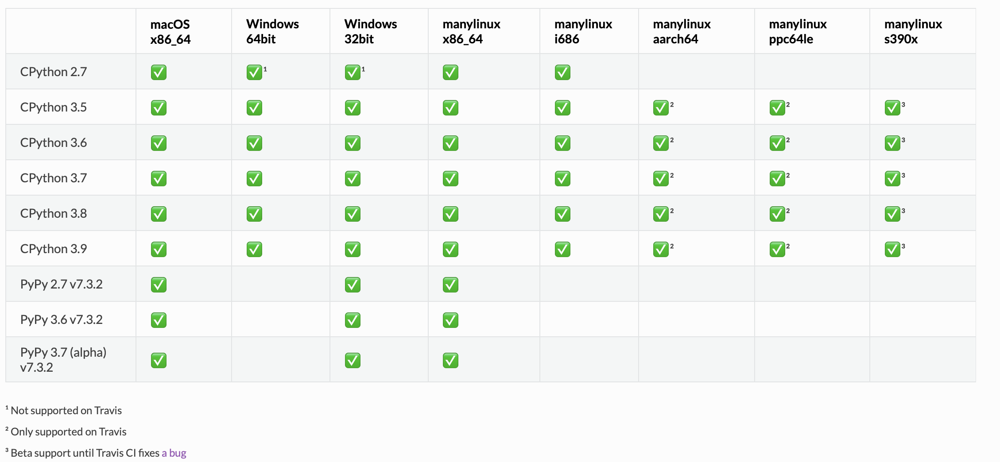
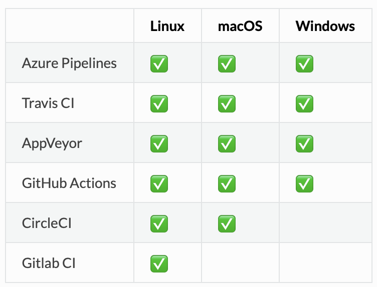

# Initialize presentation...

<!--
Run with pandoc -t beamer --template=presentation.beamer building_a_python_library.md -o building_a_python_library.pdf
Other useful options:
classoption: aspectratio=169, smaller

Note that this comment will cause the --slide-level option to be unneeded if left after the correct heading.
/presentationhypersetup can be added for auto-fullscreen
-->

```bash
$ cookiecutter gh:henryiii/presentation
title [My Presentation]: Building a Python library
directory_name [building_a_python_library]:
file_name [building_a_python_library]:
full_name [John Doe]: Henry Schreiner
Select type:
1 - tex
2 - md
Choose from 1, 2 [1]: 2
remate [https://github.com/henryiii/presentation.git]:
```


# Initialize presentation... (2)

```bash
cd building_a_python_library
gh repo create
? Repository name building_a_python_library
? Repository description Building a Python Library talk
? Visibility Public
? This will create 'building_a_python_library' in your current directory.
                                                             Continue?  Yes
v Created repository henryiii/building_a_python_library on GitHub
v Added remote git@github.com:henryiii/building_a_python_library.git
```


# Building a Python Library


## Current best tooling
- Setting up with environments
- Static checking and QC
- Using CI (GitHub Actions)
- Focus on a library with an extension
- Using modern setuptools or CMake
- Brief mention of other methods for pure Python
- Focus on pybind11 for bindings
- Distributing on PyPI & conda-forge


This is heavily based on <https://scikit-hep.org/developer> & <https://iscinumpy.gitlab.io>


# Virtual environments

No, I don't have a cookie cutter. Yet?

::: columns
::: column

```bash
python3 -m venv venv
pip install -e .[dev]
```

## venv

- Simple, built into Python (3)
- Local environments ideal
- Lowest common denominator
- Supports Fish shell. :)

:::
::: column

```bash
conda env create
```
::: div

## conda

- Supports heavy tools, like HEP's ROOT
- Always use "conda-forge"
- Define your environment in `environment.yml` (used if found)

:::

```yml
name: mypackage
channels:
  - conda-forge
dependencies:
  - pip >=18
  - pytest >=5
  - pip:
    - -e .
```

:::
:::

# PEP 517/518 building (Pip 10+)


```python
[build-system]
requires = ["setuptools>=42", "wheel"]
build-backend = "setuptools.build_meta"
```


::: div

## What happens
- Python creates a temporary virtual environment - PEP 518
    - The `requires` are downloaded
- The build-backend is used to build - PEP 517

## What you get
- Reproducible builds - CI and local
- Freedom to use dependencies in setup.py
- Freedom from setuptools if desired


:::

See <https://github.com/pybind/python_example/pull/64>

# Aside: Pin NumPy if used!

You can't load a wheel built with a newer version of NumPy!

```toml
requires = [
    "numpy==1.13.3; python_version<='3.6'",
    "numpy==1.14.5; python_version=='3.7'",
    "numpy==1.17.3; python_version>='3.8'",
```

Note that pybind11 does _not_ require NumPy when building, avoiding this entirely.

> You can disable PEP 518 with `--no-build-isolation`. Mostly used (automatically) for Conda-Build.

# PyPI Build

But what if you want to build SDists or Wheels? There isn't a command for that! Or there wasn't...

::: columns
::: column

```python
# Bad
python setup.py sdist

# Wheel only and not quite right
pip wheel .

# New, builds wheels and sdists!
python -m pip install build
python -m build
```
::: 
::: column

## PyPI build
- Very young, but already "official"
- Mostly usable, ask me if you want more details

## Warnings if not using it
- Avoid direct usage of setup.py
    - Pip does some patching for you
- Wheelhouse directory has _all_ built wheels

:::
:::


# Versioning

I really like `setuptools_scm`. The version _is_ the git tag.

::: columns
::: column

## Features
- No manual version changes
- Version hardcoded into the wheel
- Each git commit has a unique version
- Can be overridden with an env var

:::
::: column

## Drawbacks

- The CI checkout can be a little tricky
- Dirty directories break the version (feature/drawback)

:::
:::

# Setup.cfg

I'm a big fan of `setup.cfg` for most of the content that used to go in `setup.py`.


::: columns
::: column

::: div

## setup.cfg
- All declarative info; name, etc.
- Description can come from a file
- Version can come from a file or attr (newer versions smarter)

:::

```toml
[metadata]
name = package
author = My Name
...
```


:::
::: column

::: div

## setup.py
- Often put extras here to make "all" and such
- Compiled extensions
- Occasional special logic

:::

```python
from setuptools import setup
setup()
```

:::
:::

# Alternatives

This is the only reasonable system if you want compiled extensions. There are options for pure Python, though!

## PEP 517 tools
- All tools tend to use `pyproject.toml` only. However, you still need an extra file for flake8 and some others.

::: columns
::: column
## Flit
- Written by an Jupyter dev
- Much smarter defaults, very simple
- Somewhat helpful CLI
- Adds a setup.py file to the SDist

:::
::: column

## Poetry
- All in one solution
    - Environment management, pinning
- Fancy CLI, little like a cookie cutter
- Eventually extendable

:::
:::

Biggest drawback is that editable installs are not covered by PEP 517 (WIP). Note they all just produce a wheel, and are not used after that.


# CI - GitHub Actions - Pure Python


::: columns
::: column

```yaml
name: CD
on:
  workflow_dispatch:
  release:
    types:
    - published
jobs:

```

:::
::: column

```yaml
dist:
  runs-on: ubuntu-latest
  steps:
   - uses: actions/checkout@v1
   - uses: actions/setup-python@v2
   - name: Install Build
     run: python -m pip install build
   - name: Build SDist and wheel
     run: python -m build
   - uses: actions/upload-artifact@v2
     with:
       path: dist/*
```

:::
:::


# CI - GitHub Actions - Pure Python (2)


```yaml
  publish:
    needs: [dist]
    runs-on: ubuntu-latest
    if: github.event_name == 'release' && github.event.action == 'published'

    steps:
    - uses: actions/download-artifact@v2
      with:
        name: artifact
        path: dist
    - uses: pypa/gh-action-pypi-publish@v1.4.1
      with:
        user: __token__
        password: ${{ secrets.pypi_password }}
```

Use dependabot to keep your actions up to date!


# CI - GitHub Actions - Binary wheels via cibuildwheel

::: columns
::: column

```yaml
env:
  CIBW_TEST_EXTRAS: test
  CIBW_TEST_COMMAND: pytest {project}/tests
  CIBW_BUILD_VERBOSITY: 1

jobs:
  build_wheels:
    name: Wheel on ${{ matrix.os }}
    runs-on: ${{ matrix.os }}
    strategy:
      matrix:
        os:
        - ubuntu-18.04
        - windows-latest
        - macos-latest
```

:::
::: column

```yaml

  steps:
  - uses: actions/checkout@v1
  - uses: actions/setup-python@v2
  - name: Install cibuildwheel
    run: pip install cibuildwheel==1.6.4
  - name: Build wheel
    run: python -m cibuildwheel
    env:
      CIBW_SKIP: cp27*
  - name: Upload wheels
    uses: actions/upload-artifact@v2
    with:
      path: wheelhouse/*.whl
```

:::
:::

---



# cibuildwheel

* Great maintainers ;)
* Use by matplotlib and many other packages
* Supported Python 3.9 in RC stage, 3.9.0 almost immediately.


{ height=60% }


# Style: pre-commit

One single interface to all linting, on CI and locally. AMAZING!

```yaml
repos:
- repo: https://github.com/pre-commit/pre-commit-hooks
  rev: v3.1.0
  hooks:
  - id: check-added-large-files
  - id: check-case-conflict
  - id: check-merge-conflict
  - id: check-symlinks
  - id: check-yaml             # Finds duplicate keys!
  - id: debug-statements
  - id: end-of-file-fixer
  - id: mixed-line-ending
  - id: requirements-txt-fixer
  - id: trailing-whitespace
  - id: fix-encoding-pragma    # Python 2 encoding pragmas
```

# Style: pre-commit (2)

```yaml
- repo: https://github.com/psf/black
  rev: 19.10b0
  hooks:
  - id: black

- repo: https://github.com/pre-commit/mirrors-mypy
  rev: v0.782
  hooks:
  - id: mypy
    files: src

# The author is also a flake8 lead
- repo: https://gitlab.com/pycqa/flake8
  rev: 3.8.3
  hooks:
  - id: flake8
    additional_dependencies: [flake8-bugbear]
```

# Style: pre-commit usage

::: columns
::: column

Using it is easy. Manual mode:

```bash
# Check all files
pre-commit run -a

# Update your versions
pre-commit autoupdate
```


:::
::: column

"Pre-commit" mode (faster):

```bash
pre-commit install

git commit -m "..." # Runs here,
                    # fail stops commit

git commit -n ...   # Skip the checks
```

:::
:::

# Style: pre-commit GitHub Action

```yaml
pre-commit:
    name: Format
    runs-on: ubuntu-latest
    steps:
    - uses: actions/checkout@v2
    - uses: actions/setup-python@v2
    - uses: pre-commit/action@v2.0.0
```

This _caches the environments_, so generally takes under 10 seconds to run!


# Other tools

* PyTest for all testing
* Black for styling
* Flake8 with at least bugbear
* MyPy for newer projects
* Check-Manifest (pre-commit integration) (with manual stage for pre-commit if slow)
* cmake-format (pre-commit integration)
* Sphinx for docs (often with executablebook styling)


# MyPy example

Find the problem with this code that is not caught in tests:

```python
from typing import Optional

def f(i: Optional[int]) -> int:
    return i + 1

def test_f():
    assert f(3) == 4
    assert f(0) == 1
    assert f(-2) == 2
```

. . .

MyPy can detect it! `Union[None, int]` cannot add 1, since `None + 1` is invalid!

# pybind11

* Great maintainers ;)
* Amazing tool using templated C++ to generate bindings, no external tools needed!
* Several clever tricks, like not requiring NumPy at compile time.
* Used by Google, PyTorch, SciPy, and more.


```c++
#include <pybind11/pybind11.h>
namespace py = pybind11;

int add(int i, int j) {
    return i + j;
}

PYBIND11_MODULE(example, m) {
    m.def("add", &add, "Add two numbers");
}
```

# pybind11 2.6.0

Major release with exciting new features! <https://iscinumpy.gitlab.io/post/pybind11-2-6-0/>


* Stability: completely new CI, built on GitHub Actions
    * 60+ runs including NVCC, PGI, C++20, MSVC versions, and more
    * Extra parallel runs funded by Google! :)
* Major CMake rewrite
    * FindPython support, venv/conda support
    * CUDA support, Pythonlesss setup, and more
* Major Packaging rewrite
* New module: Setuptools helpers
    * Simple setup
    * Parallel compile support without NumPy
* Workaround bug in CPython 3.9.0, PyPy full support, C++20 support, and much more
* Better code correctness support
* New keyword/positional arguments, `py::type::of`, `py::prepend()`, and much more

# pybind11 setup helpers (PEP 518 recommended!)

```python
from pybind11.setup_helpers import Pybind11Extension, ParallelCompile

ext_modules = [
  Pybind11Extension(
    "myext",
    sorted(SRC_FILES),
    include_dirs=INCLUDE_DIRS,
    cxx_std=11,
    extra_compile_args=["/d2FH4-"] if sys.platform.startswith("win32") else [],
  )
]

ParallelCompile("NPY_NUM_BUILD_JOBS").install()

setup(...
```

# Usage

You can see some of the things I've talked about in action in:

* `boost-histogram`
* `hist` (pure Python, builds on boost-histogram)
* `vector` (WIP pure Python)
* and more of the 30+ packages in Scikit-HEP!

In the future, AwkwardArray will convert to cibuildwheel.

\backupbegin

# Links

* <https://iscinumpy.gitlab.io>
* <https://scikit-hep.org/developer>

\backupend
